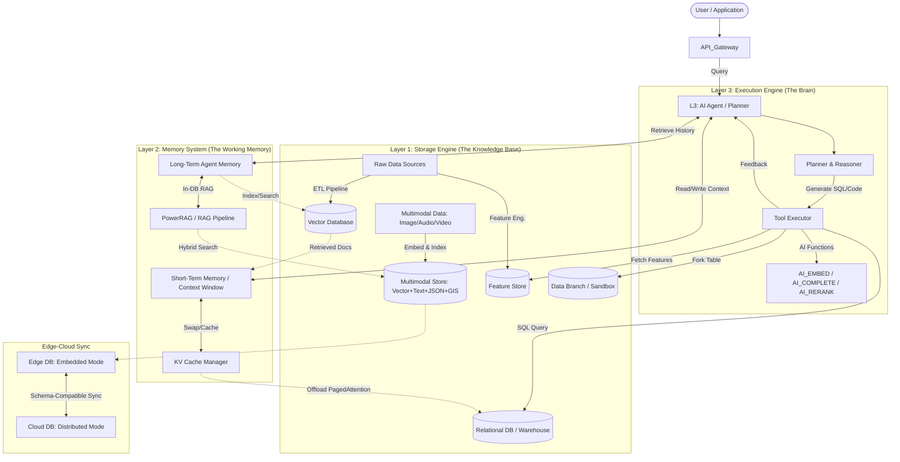

# AI-DB System Architecture: A Unified Framework

> **Status**: DRAFT for VLDB Survey
> **Goal**: Define the roles and interactions of databases within modern AI systems.

## 1. The Three-Layer Architecture

We propose a unified hierarchical framework to categorize the diverse intersections of Database and AI research. 

| Layer             | Role                 | Primary Responsibility                                                    | Key Technologies                            |
| :---------------- | :------------------- | :------------------------------------------------------------------------ | :------------------------------------------ |
| **L3: Execution** | **Active Component** | Orchestrates logic, plans queries, and interacts with users/tools.        | DB Agents, Text-to-SQL, Multi-Agent Systems |
| **L2: Memory**    | **Runtime State**    | Manages transient state, context, and intermediate data during inference. | Agent Memory, KV Cache, Session Store       |
| **L1: Storage**   | **Persistent Data**  | Stores the "World Knowledge" and "Skills" required by the AI.             | Vector DB, Feature Store, Relational DB     |

## 2. System Architecture Diagram

The following diagram illustrates the data flow and component interaction in a production-grade AI system.

## 3. Component Details & Research Gaps

### Layer 1: Storage Engine
- **Vector Database**: Mature. Focus on HNSW, PQ, and System issues (resource isolation).
- **Feature Store**: **[Gap Filled]** Manages training-serving skew. Key systems: Feast.
- **Relational DB**: The target of Text-to-SQL.
- **Multimodal Unified Storage**: **[New]** Co-managing vectors, fulltext, JSON, GIS in one engine. Key system: seekdb (LSM-Tree based, ACID compliant). Competes with pgvector+PostGIS (extension approach) vs. multi-system assembly (Milvus+ES+PG).
- **Data Branching**: **[New]** Copy-on-Write table forking for AI experimentation (seekdb Fork Table, Neon branching). Enables reproducible feature snapshots and isolated A/B testing.

### Layer 2: Memory System
- **Agent Memory**: Bridging the gap between stateless LLMs and stateful applications. **[New]** DB-native memory (seekdb PowerMem) vs. application-layer memory (MemGPT, Mem0). **[New]** OpenClaw case study (161K stars): dual backend (SQLite+FTS5+sqlite-vec vs. LanceDB plugin), four-type context taxonomy validates L1/L2 mapping. Multimodal memory (visual-spatial for embodied AI) is an open frontier.
- **KV Cache**: **[Gap Filled]** The "Virtual Memory" of LLM serving. Key systems: vLLM (PagedAttention), Mooncake (Disaggregated).
- **Runtime State**: Checkpointing for long-running workflows (LangGraph). **[New]** Fork Table as per-agent data sandbox for multi-agent isolation.
- **In-database RAG**: **[New]** Entire RAG pipeline inside the DB engine (seekdb PowerRAG: parse → chunk → embed → index → retrieve in SQL). Reduces data movement vs. application-layer RAG (LangChain/LlamaIndex).

### Layer 3: Execution Engine
- **Text-to-SQL**: Translating intent to query. Evolution from single-shot to multi-agent (MAC-SQL).
- **DB Agents**: Autonomous agents that manage database administration (tuning, indexing).
- **In-database AI Functions**: **[New]** AI_EMBED, AI_COMPLETE, AI_RERANK as SQL-level primitives (seekdb, MindsDB). Moves inference into the query engine.

## 4. Cross-Cutting Dimensions

### Multimodal Data Management
A vertical thread across all three layers: L1 stores heterogeneous data types (vector+text+JSON+GIS) in unified engines; L2 manages multimodal agent memory and cross-modal RAG retrieval; L3 handles multimodal query inputs (image → embedding → SQL). Current gap: no systematic DB-community treatment of multimodal AI data management.

### Cloud-Edge-Device Deployment
AI databases must span deployment scales: embedded mode on edge devices (1C2G, robots, vehicles) ↔ distributed clusters on cloud. Key requirements: lightweight runtime, offline capability, schema-compatible sync. seekdb (embedded ↔ OceanBase distributed) is the primary example; SQLite+FAISS is the ad-hoc baseline.

## 5. Evaluation Strategy (Low-Experiment Approach)

To align with modern VLDB survey standards while minimizing heavy engineering overhead, we propose a **multi-pronged evaluation strategy** that replaces end-to-end benchmarking with a combination of analytical and lightweight empirical methods.

### 5.1 Taxonomy Validation via Case Studies (Primary)

The core contribution of a survey is the *taxonomy itself*. We validate it by showing it can explain the design decisions of real, widely-used systems.

**Approach**: Deep architecture analysis of representative open-source systems, mapping their internal design to our three-layer framework.

| Case Study           | Stars | Coverage                                                             | What It Validates                                         |
| :------------------- | ----: | :------------------------------------------------------------------- | :-------------------------------------------------------- |
| OpenClaw             |  161K | L2 Memory (4-type context taxonomy, dual backend: SQLite vs LanceDB) | Memory hierarchy mapping; embedded DB for personal agents |
| Milvus               |   36K | L1 Storage (tiered storage, WAL, cloud-native)                       | Purpose-built vector DB architecture                      |
| vLLM                 |   52K | L2 KV Cache (PagedAttention, CoW prefix sharing)                     | OS-inspired memory management for AI                      |
| LangGraph            |   12K | L2 Runtime State (checkpointer, time-travel debugging)               | Workflow state persistence                                |
| seekdb               |  2.4K | L1+L2+L3 cross-layer (multi-model storage, PowerMem, Fork Table)     | Unified AI-native DB design                               |
| Weaviate Query Agent |     — | L3 Agentic Search (schema inspection, sub-query routing, reranking)  | Read-only vs read-write DB agent spectrum                 |

**Why this works for VLDB**: The survey community values systematic *classification* over raw numbers. A taxonomy that can place 6 diverse systems into a coherent framework, and explain *why* they made different DB choices, is a stronger contribution than benchmarking any single system.

### 5.2 Feature Matrix Tables (Comparative)

Create structured comparison tables across key dimensions.

**Example: Agent Memory Backend Comparison**

| Dimension               | MemGPT        | Mem0                    | OpenClaw (SQLite) | OpenClaw (LanceDB) | seekdb PowerMem            |
| :---------------------- | :------------ | :---------------------- | :---------------- | :----------------- | :------------------------- |
| Storage model           | Vector + KV   | Vector + Graph + KV     | Markdown + SQLite | LanceDB (embedded) | DB-native                  |
| Search type             | Vector ANN    | Hybrid (vector + graph) | BM25 + Vector     | Vector + metadata  | Hybrid                     |
| ACID                    | No            | No                      | Partial (SQLite)  | No                 | Yes                        |
| Multi-agent consistency | No            | No                      | No                | No                 | Yes                        |
| Auto memory capture     | No            | Yes (LLM extraction)    | Hook-based        | Hook-based         | On write                   |
| Multimodal              | No            | No                      | No                | Yes (Lance format) | Yes (Vector+Text+JSON+GIS) |
| Deployment              | Client-server | Client-server           | Embedded          | Embedded           | Embedded/Server            |

These tables replace benchmarks by revealing **design trade-off patterns**: e.g., embedded DBs sacrifice consistency for deployment simplicity; DB-native approaches gain ACID but lose flexibility.

### 5.3 Micro-Benchmarks (Illustrative, Not Comparative)

Small, reproducible scripts that **illustrate a concept**, not compare systems.

- **vLLM memory saving**: Reproduce the memory fragmentation reduction using vLLM's built-in benchmark scripts (available in repo), showing paged vs. contiguous allocation.
- **Hybrid search relevance**: A tiny (100-doc) demo showing BM25-only vs. vector-only vs. hybrid retrieval quality on a domain-specific query set, illustrating why hybrid search matters.
- **Fork Table overhead**: If seekdb access is available, measure fork creation latency on tables of varying size, illustrating CoW overhead characteristics.

These are not "experiments" in the VLDB sense — they are **illustrative examples** that make the survey's architectural arguments concrete.

### 5.4 Meta-Analysis of Reported Numbers

Aggregated tables and trend charts from original papers.

- **Text-to-SQL accuracy over time**: Spider / BIRD leaderboard numbers plotted across model generations.
- **Vector DB throughput comparison**: Numbers reported in the VectorDB Survey (Han et al. 2024), reproduced as summary table.
- **RAG quality vs. retrieval method**: Self-RAG / GraphRAG reported numbers side-by-side.

### 5.5 Open-Source Architecture Mining

Analyze the source code of popular frameworks to extract DB-related design decisions as evidence.

| Evidence Type                          | Source                          | What It Shows                  |
| :------------------------------------- | :------------------------------ | :----------------------------- |
| OpenClaw memory backend selection      | Source code analysis            | Real-world DB choice rationale |
| LangGraph checkpointer implementations | 4 backend plugins               | State persistence design space |
| AutoGen conversation storage           | In-memory dict (no persistence) | Gap in current MAS frameworks  |
| Weaviate Agent sub-agent architecture  | Blog + docs                     | Agentic Search decomposition   |

This is a legitimate VLDB methodology — the survey community has precedent for "system analysis" papers that dissect open-source codebases.

### 5.6 Why This Strategy Works

**Key insight**: For a *survey* paper (as opposed to a systems paper), the contribution is the **framework** and the **comprehensive coverage**, not new experimental results. VLDB surveys are evaluated on:
- Coverage breadth and systematic organization (our 3-layer taxonomy)
- Identification of research gaps and open problems
- Usefulness as a reference for future researchers

Our evidence hierarchy: **Case Studies > Feature Matrices > Meta-Analysis > Illustrative Micro-Benchmarks**

The case studies and feature matrices together form a "structured analysis" that is more valuable than A-vs-B benchmarks, because they reveal *why* different systems make different choices — which is exactly what survey readers need.

---
**Status**: Framework populated with cross-layer case studies. Next: flesh out individual chapter drafts using the case study evidence.
