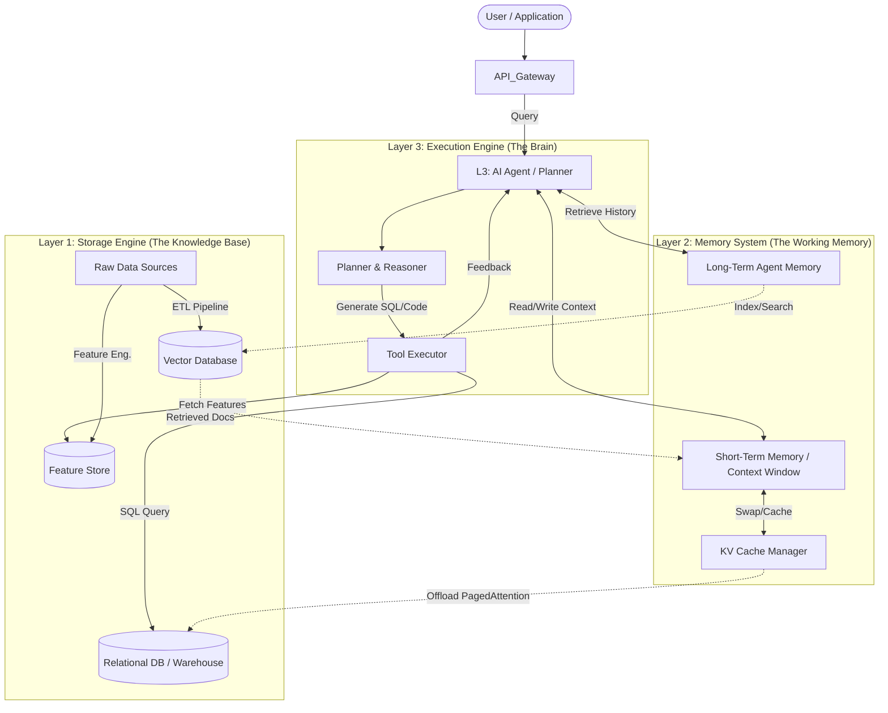

# AI-DB System Architecture: A Unified Framework

> **Status**: DRAFT for VLDB Survey
> **Goal**: Define the roles and interactions of databases within modern AI systems.

## 1. The Three-Layer Architecture

We propose a unified hierarchical framework to categorize the diverse intersections of Database and AI research. 

| Layer             | Role                 | Primary Responsibility                                                    | Key Technologies                            |
| :---------------- | :------------------- | :------------------------------------------------------------------------ | :------------------------------------------ |
| **L3: Execution** | **Active Component** | Orchestrates logic, plans queries, and interacts with users/tools.        | DB Agents, Text-to-SQL, Multi-Agent Systems |
| **L2: Memory**    | **Runtime State**    | Manages transient state, context, and intermediate data during inference. | Agent Memory, KV Cache, Session Store       |
| **L1: Storage**   | **Persistent Data**  | Stores the "World Knowledge" and "Skills" required by the AI.             | Vector DB, Feature Store, Relational DB     |

## 2. System Architecture Diagram

The following diagram illustrates the data flow and component interaction in a production-grade AI system.

## 3. Component Details & Research Gaps

### Layer 1: Storage Engine
- **Vector Database**: Mature. Focus on HNSW, PQ, and System issues (resource isolation).
- **Feature Store**: **[Gap Filled]** Manages training-serving skew. Key systems: Feast.
- **Relational DB**: The target of Text-to-SQL.

### Layer 2: Memory System
- **Agent Memory**: Bridging the gap between stateless LLMs and stateful applications.
- **KV Cache**: **[Gap Filled]** The "Virtual Memory" of LLM serving. Key systems: vLLM (PagedAttention), Mooncake (Disaggregated).
- **Runtime State**: Checkpointing for long-running workflows (LangGraph).

### Layer 3: Execution Engine
- **Text-to-SQL**: Translating intent to query. Evolution from single-shot to multi-agent (MAC-SQL).
- **DB Agents**: Autonomous agents that manage database administration (tuning, indexing).

## 4. Evaluation Strategy (Low-Experiment Approach)

To align with modern VLDB survey standards while minimizing heavy engineering overhead, we propose:

1.  **Architecture Analysis (Primary)**: 
    - Compare systems based on *design choices* (e.g., PagedAttention vs. Contiguous Memory) rather than raw benchmarks.
    - Create "Feature Matrix" tables (e.g., "Does it support CoW? Does it support tiered storage?").

2.  **Micro-Benchmarks (Secondary)**:
    - Instead of building a full "Text-to-SQL + RAG + Vector" end-to-end system, run isolated scripts.
    - **Example**: Reproduce the *memory saving* of vLLM using a simple script (available in vLLM repo) without training a model.
    - **Example**: Measure the *latency overhead* of a Feature Store lookup vs. direct DB join using a minimal 100-row dataset.

3.  **Meta-Analysis**:
    - Aggregated tables of reported numbers from the original papers (e.g., "Spider Accuracy over Time").

---
**Status**: The conceptual framework is populated. Next steps are to write the detailed notes for L1-FeatureStore and L2-KVCache.
